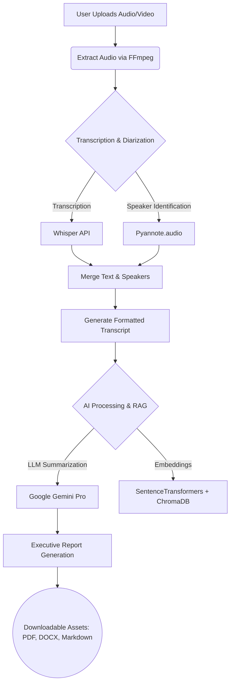

# 🧠 SynthAI — Meeting Intelligence (Milestone 1)

> Transform unstructured meetings into structured, actionable intelligence.

SynthAI is a powerful end-to-end meeting analysis pipeline that takes audio/video recordings and automatically transcribes, diarizes (speaker identification), and generates executive summaries and detailed reports.

---

## 🏗️ System Architecture & Pipeline

SynthAI operates on a robust, multi-stage data processing pipeline designed to handle large media files and extract rich contextual information.



### 1. Data Ingestion & Preprocessing
When a user uploads an audio (`.mp3`, `.wav`, etc.) or video (`.mp4`, `.mkv`, etc.) file, the system uses `FFmpeg` to extract a standardized audio track, normalizing the bit rate and sample rate for optimal machine learning inference.

### 2. Transcription Engine (Whisper)
We leverage OpenAI's **Whisper** model for highly accurate, multi-lingual speech-to-text transcription. The audio is chunked if necessary to avoid memory limits and processed locally.

### 3. Speaker Diarization (Pyannote)
In parallel or sequence, **Pyannote.audio** analyzes the acoustic features of the audio track to identify "who spoke when." It creates segments and assigns speaker labels (e.g., Speaker 1, Speaker 2).

### 4. Alignment & Merging
The raw text from Whisper and the time-stamped speaker segments from Pyannote are merged to create a coherent, readable transcript formatted as `[Speaker A]: "Hello world"`.

### 5. Vector Database & RAG (Retrieval-Augmented Generation)
The finalized transcript is chunked and embedded using **SentenceTransformers**, then stored locally in a **ChromaDB** vector database. This allows users to ask questions ("Chat with the Meeting") and retrieve specific contexts quickly.

### 6. AI Summarization (Gemini)
The structured transcript is sent to **Google Gemini**, which acts as the intelligent synthesizer. It is prompted to generate:
- Executive summaries
- Action items
- Key decisions
- Sentiment analysis

---

## 🛠️ Tech Stack

| Component | Technology | Purpose |
| --- | --- | --- |
| **Frontend** | [Streamlit](https://streamlit.io/) | Interactive, data-driven web UI |
| **Transcription** | [Whisper](https://github.com/openai/whisper) | State-of-the-art Speech-to-Text |
| **Diarization** | [Pyannote](https://github.com/pyannote/pyannote-audio) | Speaker identification and segmentation |
| **LLM & GenAI** | [Google Gemini](https://deepmind.google/technologies/gemini/) | Complex reasoning and report generation |
| **Vector DB** | [ChromaDB](https://www.trychroma.com/) | Local vector storage for document retrieval |
| **Embeddings** | [SentenceTransformers](https://sbert.net/) | Creating dense vector representations |
| **Media Processing**| FFmpeg / MoviePy | Audio extraction and conversion |
| **Export Formats** | xhtml2pdf, python-docx | Generating downloadable files |

---

## 🚀 Complete Setup Guide

Follow these instructions strictly to get the project running on your local machine.

### Prerequisites

1. **Python 3.9 - 3.11** installed.
2. **FFmpeg** installed (an `ffmpeg.exe` binary is included for Windows convenience, but system-level installation is recommended).
3. **API Keys**:
   - Google Gemini API Key (Get it from [Google AI Studio](https://aistudio.google.com/))
   - HuggingFace Access Token (Required for Pyannote models)

### Step 1: Clone the Repository
```bash
git clone https://github.com/Nipunbhadane123/Career_intelligance.git
cd Career_intelligance/Milestone_1
```

### Step 2: Create a Virtual Environment (Recommended)
```bash
python -m venv venv
# On Windows:
.\venv\Scripts\activate
# On Mac/Linux:
source venv/bin/activate
```

### Step 3: Install Dependencies
```bash
pip install -r requirements.txt
```

> [!WARNING]
> Pyannote and Whisper have specific PyTorch requirements. If you encounter issues, ensure you install the correct PyTorch version for your system (CUDA vs CPU) from [pytorch.org](https://pytorch.org/).

### Step 4: HuggingFace Authentication
Pyannote requires you to accept user agreements for its models.
1. Go to [pyannote/speaker-diarization-3.1](https://huggingface.co/pyannote/speaker-diarization-3.1) and accept the terms.
2. Go to [pyannote/segmentation-3.0](https://huggingface.co/pyannote/segmentation-3.0) and accept the terms.

### Step 5: Run the Application
Start the Streamlit application:
```bash
streamlit run app.py
```

### Step 6: Using the App
1. Once the web interface opens (usually at `http://localhost:8501`), look at the sidebar.
2. Enter your **Google Gemini API Key**.
3. Enter your **HuggingFace Token**.
4. Upload an audio or video file.
5. Wait for the processing pipeline to complete (this may take a while depending on your hardware).
6. Explore the interactive transcript, download the reports, or chat with the meeting!

---

## 📜 License
This project is licensed under the [MIT License](../LICENSE).
