# 🧠 SynthAI Enterprise — System Architecture & Dataflow Specification

This document provides the formal architecture specification, component interaction model, and dataflow diagrams for **SynthAI Enterprise Meeting Intelligence (Milestone 3 & Milestone 4 Continuous Integration)**.

---

## 🗺️ Complete End-to-End System Flowchart

The following flowchart illustrates the complete lifecycle from ingestion to grounded RAG responses, mirroring the project layout:

```mermaid
flowchart TD
    %% ─────────────────────────────────────────────
    %% STYLES & CLASSES
    %% ─────────────────────────────────────────────
    classDef inputStyle fill:#1e293b,stroke:#38bdf8,stroke-width:1.5px,color:#f8fafc;
    classDef asrStyle fill:#1e1e38,stroke:#6366f1,stroke-width:1.5px,color:#f8fafc;
    classDef llmPrimary fill:#1e2238,stroke:#818cf8,stroke-width:2px,color:#a5b4fc;
    classDef llmFallback fill:#2d1c0a,stroke:#f59e0b,stroke-width:1.5px,stroke-dasharray: 4 4,color:#fde68a;
    classDef insightStyle fill:#0f172a,stroke:#38bdf8,stroke-width:1.5px,color:#e0f2fe;
    classDef dbStyle fill:#1e293b,stroke:#64748b,stroke-width:1.5px,color:#f8fafc;
    classDef chromaStyle fill:#1e293b,stroke:#38bdf8,stroke-width:2px,color:#38bdf8;
    classDef ragStyle fill:#0f291e,stroke:#10b981,stroke-width:2px,color:#6ee7b7;
    classDef appStyle fill:#1a2234,stroke:#4f46e5,stroke-width:1.5px,color:#f8fafc;

    %% ─────────────────────────────────────────────
    %% 1. MULTI-PLATFORM INGESTION & AUDIO PIPELINE
    %% ─────────────────────────────────────────────
    subgraph Ingestion_Layer ["1. Multi-Platform Ingestion & Audio Pipeline"]
        Upload["📤 Local Media Upload<br/>(MP4, MP3, WAV, M4A)"]:::inputStyle
        Zoom["📹 Zoom Cloud Sync<br/>(OAuth + Webhook + CRC)"]:::inputStyle
        GMeet["🌐 Google Meet Drive<br/>(Drive API + Auto Sync)"]:::inputStyle

        FFmpeg["⚙️ FFmpeg Audio Extraction<br/>(16kHz Mono WAV Normalization)"]:::asrStyle
        Whisper["🎙️ Whisper ASR<br/>(Timestamped Transcript Chunks)"]:::asrStyle
        PyAnnote["👥 PyAnnote Audio<br/>(Speaker Diarization Alignment)"]:::asrStyle

        Upload --> FFmpeg
        Zoom --> FFmpeg
        GMeet --> FFmpeg

        FFmpeg --> Whisper
        Whisper --> PyAnnote
    end

    %% ─────────────────────────────────────────────
    %% 2. AI SYNTHESIS & INSIGHT EXTRACTION
    %% ─────────────────────────────────────────────
    subgraph Synthesis_Layer ["2. AI Synthesis & Insight Extraction"]
        GeminiPrimary["✨ Gemini Primary<br/>(gemini-2.5-flash / 2.0-flash / 1.5-pro)"]:::llmPrimary
        FallbackTrigger{"⚠️ Error / Quota?"}
        OpenAIFallback["⚡ OpenAI / Local Fallback<br/>(Heuristic Extraction)"]:::llmFallback
        StructuredInsights["📋 Structured JSON Insights<br/>(Executive Summary, Decisions, Actions, Sentiment)"]:::insightStyle

        PyAnnote --> GeminiPrimary
        GeminiPrimary -.->|Quota Exceeded / Timeout| FallbackTrigger
        FallbackTrigger -.->|Yes| OpenAIFallback
        FallbackTrigger -.->|No| GeminiPrimary
        GeminiPrimary --> StructuredInsights
        OpenAIFallback --> StructuredInsights
    end

    %% ─────────────────────────────────────────────
    %% 3. KNOWLEDGE BASE & RAG LAYER
    %% ─────────────────────────────────────────────
    subgraph Knowledge_Base_RAG ["3. Knowledge Base & RAG Layer"]
        SQLiteDB[("🗄️ SQLite Metadata DB<br/>(Meetings, Users, Auth, History)")]:::dbStyle

        UserQuery["🔍 User Search Query"]:::inputStyle
        QueryEmbed["⚡ Query Embedding"]:::asrStyle

        Chunking["📄 Transcript & Insight Chunking<br/>(500-char Sliding Window)"]:::inputStyle
        STEmbed["🧠 Sentence-Transformers Embeddings<br/>(all-MiniLM-L6-v2, 384-dim)"]:::asrStyle

        ChromaDB[("🔮 ChromaDB Vector Store<br/>(Persistent HNSW Cosine Index)")]:::chromaStyle

        RetrievedContext["📑 Retrieved Semantic Context<br/>(Top-K Chunks + Metadata Filter)"]:::insightStyle
        GeminiRAG["🤖 Gemini RAG Engine<br/>(Context-Grounded Q&A Generation)"]:::llmPrimary
        GroundedAnswer["🎯 Grounded Answer with Sources<br/>([Source: Meeting #ID, Timestamp])"]:::ragStyle

        %% Flow connections
        StructuredInsights -->|Store Relational Metadata| SQLiteDB
        StructuredInsights -->|Chunking| Chunking
        PyAnnote -->|Chunking| Chunking

        UserQuery --> QueryEmbed
        Chunking --> STEmbed

        QueryEmbed -->|Semantic Vector Match| ChromaDB
        STEmbed -->|Upsert Chunks & Metadata| ChromaDB

        ChromaDB -->|Cosine Similarity >= 0.35| RetrievedContext
        RetrievedContext --> GeminiRAG
        UserQuery -.->|Prompt Assembly| GeminiRAG
        GeminiRAG --> GroundedAnswer
    end

    %% ─────────────────────────────────────────────
    %% 4. APPLICATION & INTERFACE DELIVERY LAYER
    %% ─────────────────────────────────────────────
    subgraph Delivery_Layer ["4. Application Delivery, API & Reports"]
        FastAPI["⚡ FastAPI Backend Daemon<br/>(Port 8000: REST API, JWT, Swagger)"]:::appStyle
        Streamlit["🎨 Streamlit Dashboard<br/>(Port 8501: Analytics, RAG UI, Sync)"]:::appStyle
        Reports["📑 Executive Reports & Export<br/>(High-Fidelity PDF + RFC-4180 CSV)"]:::appStyle

        GroundedAnswer --> Streamlit
        GroundedAnswer --> FastAPI
        SQLiteDB <--> FastAPI
        SQLiteDB <--> Streamlit
        FastAPI --> Reports
        Streamlit --> Reports
    end
```

---

## 🏗️ Layer-by-Layer Architectural Specifications

### Layer 1: Ingestion & Audio Pipeline
- **Multi-Source Ingestion**:
  - **Local Media**: Browser multipart upload supporting MP4, MP3, WAV, M4A, MOV, MKV.
  - **Zoom Cloud Integration**: Webhook event receiver (`recording.completed`) with SHA256 HMAC CRC challenge-response verification and automated background download.
  - **Google Meet Drive Integration**: Google Drive API polling for shared meeting folders with MD5 content hashing and duplicate ingestion suppression.
- **Audio Processing**:
  - **FFmpeg**: Standardizes audio to single-channel 16kHz WAV format.
  - **Whisper ASR**: Extracts timestamped text utterances with segment timestamps (`start_seconds`, `end_seconds`).
  - **PyAnnote Audio**: Segments speech turns and clusters speaker voiceprints (`Speaker_0`, `Speaker_1`).

---

### Layer 2: AI Synthesis & Insight Extraction
- **Dual-Engine Redundancy**:
  - **Primary**: Google Gemini 2.5/2.0 Flash / Pro (`gemini-2.5-flash` or `gemini-1.5-pro`) for comprehensive structured insight extraction.
  - **Fallback**: OpenAI GPT-4o-mini or local deterministic regex/heuristic fallback triggered during rate limits (HTTP 429) or offline execution.
- **Structured Schema Enforcement**:
  - Guarantees strict JSON output conforming to Pydantic models:
    - Executive Summary
    - Key Decisions
    - Action Items (with explicit Assignees, Deadlines, and Priority flags)
    - Meeting Topics & Agenda Tags
    - Sentiment & Participation Metrics

---

### Layer 3: Knowledge Base & RAG Layer
- **Relational Storage**:
  - **SQLite Database** with WAL (Write-Ahead Logging) enabled.
  - Tables: `users`, `meetings`, `action_items`, `key_decisions`, `audit_logs`, `sync_history`.
- **Vector Embedding & Chunking**:
  - **Chunking**: 500-character sliding window with 100-character overlap for continuous context preservation.
  - **Embeddings**: `sentence-transformers/all-MiniLM-L6-v2` generating 384-dimensional normalized dense vectors.
- **ChromaDB Vector Store**:
  - Persistent HNSW cosine similarity index stored in `chroma_db/`.
  - Filters vectors by `meeting_id`, `speaker`, or `date` metadata.
- **Grounded RAG Pipeline**:
  - User search queries embedded into dense space in < 15ms.
  - Cosine distance thresholding (similarity $\ge 0.35$).
  - Prompt grounding forces answers to cite source meetings and timestamp ranges: `[Source: Meeting #44, 02:15 - 03:40]`.

---

### Layer 4: Application Delivery & Enterprise Security
- **FastAPI REST API (Port 8000)**:
  - Complete OpenAPI / Swagger documentation at `http://127.0.0.1:8000/docs`.
  - Architecture visualizer at `http://127.0.0.1:8000/architecture`.
  - Bearer JWT token authentication.
- **Streamlit Web Application (Port 8501)**:
  - Tab 1: Meetings Dashboard & Multi-Platform Filtering.
  - Tab 2: Sequential Meeting Details & Analytics Deep-Dive.
  - Tab 3: RAG AI Assistant with Streaming Responses & Source Citation Badges.
  - Tab 4: Zoom Cloud Sync with Live Polling & Webhook Simulator.
  - Tab 5: Google Meet Drive Sync with Duplicate Prevention.
  - Tab 6: Executive Reports & Data Export (Base64 PDF + RFC-4180 CSV).
  - Tab 7: Multi-Tenant RBAC Isolation & Security Sandbox.
  - Tab 8: System Architecture & Dataflow Flowchart (Live Interactive SVG).
